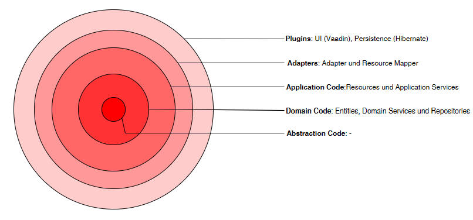

# Fire Inventory
**Fire Inventory** ist eine webbasierte Anwendung für die Inventarverwaltung der Freiwilligen Feuerwehr.
Die Anwendung ermöglicht eine einfache, flexible und individuelle Verwaltung von Gerätschaften und Fahrzeugen.
Eine anschauliche Navigation und Status-Anzeigen bieten einen schnellen Überblick über den Zustand der Geräte und Fahrzeuge.
Ein integrierter Kalendar kann für die Eintragung von Wartungs- und Reparaturterminen genutzt werden.

# Inhaltsverzeichnis
1. [Einleitung](#Einleitung)
2. [Architektur](#Architektur)
3. [Technologien](#Technologien)
4. [Start](#Start)
5. [Projektstatus](#Projektstatus)

## Einleitung

### Detailierte Beschreibung
Gerätschaften, Fahrzeuge und Räumlichkeiten für die Ablage dieser können individuell in der App angelegt werden.
Gerätschaften und Fahrzeuge sind durch Attribute wie den Ablageort, den Zustand (Funktionsfähig, Nicht Funktionsfähig und In Reparatur) und die Bezeichnung gekennzeichnet.
Diese können über die Lebensdauer dieser angepasst werden. Während sich der Zustand eines Gerätes bzw. eines Fahrzeuges lediglich auf die Kondition dieses bezieht, soll ein
errechneter Status zusätzlich Aufschluss über die Verfügbarkeit eines Fahrzeugs bzw. Gerätes unter Berücksichtigung des Ablageorts geben.


### Use Cases

<ul>
<li>Inventar: Gerät anlegen, Fahrzeug anlegen, Gerät modifizieren, Fahrzeug modifizieren, Geräte filtern, Fahrzeuge filtern <br>
<li>Örtlichkeiten: Ablageort anlegen, Ablageort umbenennen <br>
<li>Termine: Termin anlegen, Termin ändern, Termine filtern
</ul>

## Architektur
Die Architektur des Fire Inventory Projekts orientiert sich an der Clean Architecture.
Die Abstraction Code-Schicht enthält domänenübergreifende Grundbausteine. Die Domain Code-Schicht implementiert organisationsweit gültige Geschäftslogik. Die Application Code-Schicht enthält die Anwendungsfälle des FireInventory-Projekts.
Die Adapter-Schicht vermittelt Aufrufe und Daten an die inneren Schichten. Die Plugin-Schicht bindet Adapter für die graphische Oberfläche und den Datenbankzugriff an.



## Technologien

Spring Boot version: 2.7.9 <br>
Vaadin version: 23.3.0 <br>
Flyway DB version: 9.15.1 <br>
PostgreSQL version: 42.5.4

## Start

### Build
Im Hauptverzeichnis ist folgendes Kommando auszuführen:
````
mvnw clean install
````

### Start
1. Zunächst wird die Datenbank mit folgendem Befehl im Terminal gestartet:
````
cd docker/
docker-compose up
````
2. Optional können die Daten geseedet werden (siehe unten)
3. Zuletzt wird die Anwendung über die RunConfiguration gestartet (FireInventoryApplication)

Danach ist die Anwendung im Browser lokal zugänglich: http://localhost:8080

### Datenbank verwalten
Im Modul Plugins sind folgende Befehle auszuführen:
#### Clean
````
mvn properties:read-project-properties flyway:clean
````
oder über die RunConfiguration "flyway: clean db"

#### Migrationen
````
mvn properties:read-project-properties flyway:migrate
````
oder über die RunConfiguration "flyway: migrate db"

#### Seeding / Demo-Daten laden (führt dabei auch clean und migrations aus)
````
mvn properties:read-project-properties flyway:clean flyway:migrate sql:execute
````
oder über die RunConfiguration "seed db"

## Projektstatus
Das FireInventory-Projekt befindet sich noch in der Entwicklung. Insbesondere die Kalendar-Funktion soll durch Terminerinnerungen und wiederkehrende Termine erweitert werden.
Bisher können nur interne Räumlichkeiten angelegt werden - zukünftig sollen auch externe Räumlichkeiten angelegt werden können.
Bisher ist die Anwendung lediglich über die graphische Oberfläche im Browser zugänglich. Zukünftig sollen weitere Schnittstellen (REST) zu Verfügung gestellt werden.

Der letzte Commit (Stand 29.05.2023) enthält keine stabile Version des Projekts - es müssen noch Bugs gefixt werden.